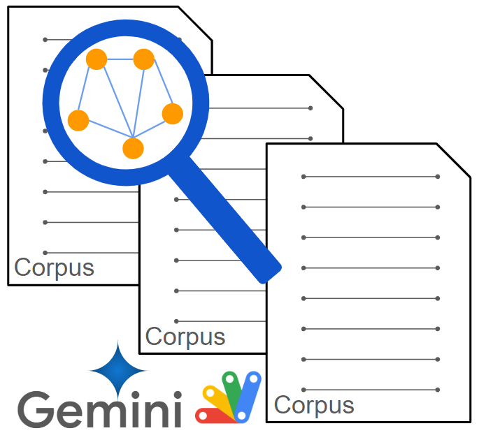

# CorporaApp

<a name="top"></a>
[MIT License](LICENCE)

<a name="overview"></a>

# Overview

This is a Google Apps Script library for managing the corpora of Gemini API.



<a name="description"></a>

# Description

The semantic search opens up a new wind for finding the expected values. Recently, the APIs for managing corpora have been added to Gemini API. [Ref](https://ai.google.dev/api/rest) When the corpora of Gemini API is used, the semantic search can be achieved. [Ref](https://medium.com/google-cloud/semantic-search-using-corpus-of-gemini-api-with-google-apps-script-9ba3c111139a) However, when the corpora are tried to be used with Google Apps Script, the script is complicated cumbersome. To address this challenge, I have created a library for managing the corpora using Google Apps Script. [Ref](https://github.com/tanaikech/CorporaApp) With this library, managing corpora becomes effortless, requiring only straightforward scripts.

# IMPORTANT

On February 4, the version of Generative Language API is v1beta. [Ref](https://ai.google.dev/api/rest) In this library, the endpoint of v1beta is used. When the v1 is released, I would like to update the endpoint in the library.

# Library's project key

```
1XrAybct1KUwGcFrEZ9BOd5sa0SoHeQwGhOWkDOHki9lDFAX9OHlO03y_
```

<a name="usage"></a>

# Usage

## 1. Install library

In order to use this library, please install the library as follows.

1. Create a GAS project.

   - You can use this library for the GAS project of both the standalone and container-bound script types.

2. [Install this library](https://developers.google.com/apps-script/guides/libraries).

   - Library's project key is **`1XrAybct1KUwGcFrEZ9BOd5sa0SoHeQwGhOWkDOHki9lDFAX9OHlO03y_`**.

## 2. Linking Google Cloud Platform Project to Google Apps Script Project for New IDE

In this case, you can see how to do this at [my repository](https://github.com/tanaikech/Linking-Google-Cloud-Platform-Project-to-Google-Apps-Script-Project-for-New-IDE).

Also, please enable Generative Language API at the API console.

After the above setting, the following sample script can be used.

# Scopes

This library uses the following 2 scopes.

- `https://www.googleapis.com/auth/script.external_request`
- `https://www.googleapis.com/auth/generative-language.retriever`

# Methods

| Methods                           | Description                                                              |
| :-------------------------------- | :----------------------------------------------------------------------- |
| [createCorpus](#createcorpus)           | Create a new corpus.  |
| [deleteCorpus](#deletecorpus)           | Delete a corpus.  |
| [getCorpora](#getcorpora)           | Get corpora list.  |
| [searchQueryFromCorpus](#searchqueryfromcorpus)           | Search chunks from a corpus.  |
| [createDocument](#createdocument)           | Create a new document in a corpus.  |
| [deleteDocument](#deletedocument)           | Delete a new document from a corpus.  |
| [getDocuments](#getdocuments)           | Get document list from a corpus. |
| [searchQueryFromDocument](#searchqueryfromdocument)           | Search chunks from a document. |
| [setChunks](#setchunks)           | Put chunks into a document. |
| [deleteChunks](#deletechunks)           | Delete chunks from a document. |
| [getChunks](#getchunks)           | Get chunk list from a document. |
| [updateChunks](#updatechunks)           | Update chunks in a document. |
| [createPermission](#createpermission)           | Create permission of corpus. |
| [deletePermission](#deletepermission)           | Delete permission of corpus. |
| [getPermissions](#getpermissions)           | Get permission list of corpus. |
| [updatePermission](#updatepermission)           | Update permission of corpus. |
| [searchQueryWithGenerateAnswer](#searchquerywithgenerateanswer)           | Search chunks using models.generateAnswer. |

In this library, the auto-completion can be used for the returned objects.

<a name="createcorpus"></a>

## createCorpus

Create a new corpus. [Ref](https://ai.google.dev/api/rest/v1beta/corpora/create)

```javascript
const res = CorporaApp.createCorpus({ displayName: "sample" });
console.log(res.getContentText());
```

When this script is run, the following result is obtained.

```json
{
  "name": "corpora/sample-###",
  "displayName": "sample",
  "createTime": "2024-01-01T00:00:00.000000Z",
  "updateTime": "2024-01-01T00:00:00.000000Z"
}
```

`corpora/sample-###` of `name` is the resource name of the created corpus.

<a name="deletecorpus"></a>

## deleteCorpus

Delete a corpus. [Ref](https://ai.google.dev/api/rest/v1beta/corpora/delete)

```javascript
CorporaApp.deleteCorpus("corpora/sample-###", false);
```

`"corpora/sample-###"` is the resource name of corpus. In this case, no value is returned.

About the 2nd argument of `false`, when this is false, when the document has chunks, the document is not deleted by occurring an error. The default value is `false`.

<a name="getcorpora"></a>

## getCorpora

Get corpora list. [Ref](https://ai.google.dev/api/rest/v1beta/corpora/list)

```javascript
const res = CorporaApp.getCorpora();
console.log(res);
```

When this script is run, the following result is obtained.

```json
[
  {
    "name": "corpora/sample-###",
    "displayName": "sample",
    "createTime": "2024-01-01T00:00:00.000000Z",
    "updateTime": "2024-01-01T00:00:00.000000Z"
  },
  ,
  ,
]
```

<a name="searchqueryfromcorpus"></a>

## searchQueryFromCorpus

Search chunks from a corpus. [Ref](https://ai.google.dev/api/rest/v1beta/corpora/query)

```javascript
const res = CorporaApp.searchQueryFromCorpus(
  "corpora/sample-###",
  { query: "sample", resultsCount: 5 }
);
console.log(res.getContentText());
```

`"corpora/sample-###"` is the resource name of corpus. When this script is run, the following result is obtained.

```json
{
  "relevantChunks": [
    {
      "chunkRelevanceScore": 0.6174245,
      "chunk": {
        "name": "corpora/sample-###/documents/sample-document-###",
        "data": {
          "stringValue": "sample value"
        },
        "customMetadata": [
          {
            "key": "key1",
            "stringValue": "value1"
          }
        ],
        "createTime": "2024-01-01T00:00:00.000000Z",
        "updateTime": "2024-01-01T00:00:00.000000Z",
        "state": "STATE_ACTIVE"
      }
    },
    ,
    ,
  ]
}
```

<a name="createdocument"></a>

## createDocument

Create a new document in a corpus. [Ref](https://ai.google.dev/api/rest/v1beta/corpora.documents#Document)

```javascript
const res = CorporaApp.createDocument(
  "corpora/sample-###",
  {displayName: "sample document"}
);
console.log(res.getContentText());
```

`"corpora/sample-###"` is the resource name of corpus. When this script is run, the following result is obtained.

```json
{
  "name": "corpora/sample-###/documents/sample-document-###",
  "displayName": "sample document",
  "createTime": "2024-01-01T00:00:00.000000Z",
  "updateTime": "2024-01-01T00:00:00.000000Z"
}
```

<a name="deletedocument"></a>

## deleteDocument

Delete a new document from a corpus. [Ref](https://ai.google.dev/api/rest/v1beta/corpora.documents/delete)

```javascript
CorporaApp.deleteDocument("corpora/sample-###/documents/sample-document-###", false);
```

`"corpora/sample-###/documents/sample-document-###"` is the resource name of document. In this case, no value is returned.

About the 2nd argument of `false`, when this is false, when the document has chunks, the document is not deleted by occurring an error. The default value is `false`.

<a name="getdocuments"></a>

## getDocuments

Get document list from a corpus. [Ref](https://ai.google.dev/api/rest/v1beta/corpora.documents/list)

```javascript
const res = CorporaApp.getDocuments("corpora/sample-###");
console.log(res);
```

`"corpora/sample-###"` is the resource name of corpus. When this script is run, the following result is obtained.

```json
[
  {
    "name": "corpora/sample-###/documents/sample-document-###",
    "displayName": "sample document",
    "createTime": "2024-01-01T00:00:00.000000Z",
    "updateTime": "2024-01-01T00:00:00.000000Z"
  },
  ,
  ,
]
```

`"corpora/sample-###/documents/sample-document-###"` is the resource name of the document.

<a name="searchqueryfromdocument"></a>

## searchQueryFromDocument

Search chunks from a document. [Ref](https://ai.google.dev/api/rest/v1beta/corpora.documents/query)

```javascript
const res = CorporaApp.searchQueryFromDocument(
  "corpora/sample-###/documents/sample-document-###",
  { query: "sample", resultsCount: 5 }
);
console.log(res.getContentText());
```

`"corpora/sample-###/documents/sample-document-###"` is the resource name of document. When this script is run, the following result is obtained.

```json
{
  "relevantChunks": [
    {
      "chunkRelevanceScore": 0.6174245,
      "chunk": {
        "name": "corpora/sample-###/documents/sample-document-###",
        "data": {
          "stringValue": "sample value"
        },
        "customMetadata": [
          {
            "key": "key1",
            "stringValue": "value1"
          }
        ],
        "createTime": "2024-01-01T00:00:00.000000Z",
        "updateTime": "2024-01-01T00:00:00.000000Z",
        "state": "STATE_ACTIVE"
      }
    },
    ,
    ,
  ]
}
```

<a name="setchunks"></a>

## setChunks

Put chunks into a document. [Ref](https://ai.google.dev/api/rest/v1beta/corpora.documents.chunks/batchCreate)

```javascript
const resourceNameOfdocument = "corpora/sample-###/documents/sample-document-###";
const res = CorporaApp.setChunks(
  resourceNameOfdocument,
  {
    requests: [{
      parent: resourceNameOfdocument,
      chunk: {
        data: { stringValue: "sample value" },
        customMetadata: [{ key: "key1", stringValue: "value1" }]
      }
    }]
  }
);
console.log(res.map(r => JSON.parse(r.getContentText())));
```

`"corpora/sample-###/documents/sample-document-###"` is the resource name of document. When this script is run, the following result is obtained.

```json
[
  { "chunks": [{ "name": "corpora/sample-###/documents/sample-document-###/chunks/###", "data": { "stringValue": "sample value" }, "customMetadata": [{ "key": "key1", "stringValue": "value1" }], "state": "STATE_ACTIVE" }] },
  ,
  ,
]
```

`corpora/sample-###/documents/sample-document-###/chunks/###` is the resource name of chunk.

It seems that in the current stage, the maximum size of value in metadata is 256 bytes. When this is over, an error like `string_value cannot be more than 256 characters long.` occurs. Please be careful about this.

<a name="deletechunks"></a>

## deleteChunks

Delete chunks from a document. [Ref](https://ai.google.dev/api/rest/v1beta/corpora.documents.chunks/batchDelete)

```javascript
const res = CorporaApp.deleteChunks(
  "corpora/sample-###/documents/sample-document-###",
  { requests: [{ name: "corpora/sample-###/documents/sample-document-###/chunks/###" }] }
);
console.log(res.getContentText());
```

- `corpora/sample-###/documents/sample-document-###` is the resource name of document.
- `corpora/sample-###/documents/sample-document-###/chunks/###` is the resource name of chunk.
- In this case, no value is returned.

<a name="getchunks"></a>

## getChunks

Get chunk list from a document. [Ref](https://ai.google.dev/api/rest/v1beta/corpora.documents.chunks/list)

```javascript
const res = CorporaApp.getChunks("corpora/sample-###/documents/sample-document-###");
console.log(res);
```

`corpora/sample-###/documents/sample-document-###` is the resource name of document. When this script is run, the following result is obtained.

```json
[
  { "name": "corpora/sample-###/documents/sample-document-###/chunks/###", "data": { "stringValue": "sample value" }, "customMetadata": [{ "key": "key1", "stringValue": "value1" }], "state": "STATE_ACTIVE" },
  ,
  ,
]
```

`corpora/sample-###/documents/sample-document-###/chunks/###` is the resource name of chunk.

<a name="updatechunks"></a>

## updateChunks

Update chunks in a document. [Ref](https://ai.google.dev/api/rest/v1beta/corpora.documents.chunks/batchUpdate)

```javascript
const res = CorporaApp.updateChunks(
  "corpora/sample-###/documents/sample-document-###",
  {
    requests: [{
      chunk: {
        name: 'corpora/sample-###/documents/sample-document-###/chunks/###',
        // data: { stringValue: 'sample value' },
        customMetadata: [{ key: "add_key", stringValue: "Add value" }]
      },
      updateMask: "customMetadata"
    }]
  }
);
console.log(res.map(r => r.getContentText()));
```

- `corpora/sample-###/documents/sample-document-###` is the resource name of document.
- `corpora/sample-###/documents/sample-document-###/chunks/###` is the resource name of chunk.

When this script is run, the following result is obtained. The custom metadata is updated.

```json
{
  "chunks": [
    {
      "name": "corpora/sample-###/documents/sample-document-###/chunks/###",
      "data": {
        "stringValue": "sample value"
      },
      "customMetadata": [
        {
          "key": "add_key",
          "stringValue": "Add value"
        }
      ],
      "createTime": "2024-01-01T00:00:00.000000Z",
      "updateTime": "2024-01-01T00:00:00.000000Z",
      "state": "STATE_PENDING_PROCESSING"
    }
  ]
}
```

<a name="createpermission"></a>

## createPermission

Create permission of corpus. [Ref](https://ai.google.dev/api/rest/v1beta/corpora.permissions/create)

```javascript
const res = CorporaApp.createPermission(
  "corpora/sample-###",
  {
    granteeType: "USER",
    emailAddress: "###email address###",
    role: "READER"
  }
);
console.log(res.getContentText());
```

`"corpora/sample-###"` is the resource name of corpus. When this script is run, the following result is obtained.

```json
{
  "name": "corpora/sample-###/permissions/###",
  "granteeType": "USER",
  "emailAddress": "###email address###",
  "role": "READER"
}
```

`corpora/sample-###/permissions/###` is the resource name of created permission.

<a name="deletepermission"></a>

## deletePermission

Delete permission of corpus. [Ref](https://ai.google.dev/api/rest/v1beta/corpora.permissions/delete)

```javascript
const res = CorporaApp.deletePermission("corpora/sample-###/permissions/###");
console.log(res.getContentText());
```

In this case, no value is returned.

<a name="getpermissions"></a>

## getPermissions

Get permission list of corpus. [Ref](https://ai.google.dev/api/rest/v1beta/corpora.permissions/list)

```javascript
const res = CorporaApp.getPermissions("corpora/sample-###");
console.log(res);
```

`"corpora/sample-###"` is the resource name of corpus. When this script is run, the following result is obtained.

```json
[
  {
    name: 'corpora/sample-###/permissions/###',
    granteeType: 'USER',
    emailAddress: '###email address###',
    role: 'OWNER'
  },
  ,
  ,
]
```

`corpora/sample-###/permissions/###` is the resource name of the permission.

<a name="updatepermission"></a>

## updatePermission

Update permission of corpus. [Ref](https://ai.google.dev/api/rest/v1beta/corpora.permissions/patch)

```javascript
const res = CorporaApp.updatePermission(
  "corpora/sample-###/permissions/###",
  { role: "WRITER" },
  { updateMask: "role" }
);
console.log(res.getContentText());
```

`corpora/sample-###/permissions/###` is the resource name of permission. When this script is run, the following result is obtained.


```json
{
  "name": "corpora/sample-###/permissions/###",
  "granteeType": "USER",
  "emailAddress": "###email address###",
  "role": "WRITER"
}
```

<a name="searchquerywithgenerateanswer"></a>

## searchQueryWithGenerateAnswer

Search chunks using models.generateAnswer. [Ref](https://ai.google.dev/api/rest/v1beta/models/generateAnswer)

```javascript
const text = "###"; // Query
const source = "###"; // e.g. corpora/123 or corpora/123/documents/abc.

const requestBody = {
  contents: [{ parts: [{ text }], role: "user" }],
  answerStyle: "VERBOSE",
  semanticRetriever: { source, query: { parts: [{ text }] } }
};
const res = CorporaApp.searchQueryWithGenerateAnswer(requestBody);
console.log(res.getContentText());
```

# Samples

Here, I would like to introduce sample scripts using this library.

## Sample 1: Semantic search of my blog.

My blog can be seen at [https://tanaikech.github.io/](https://tanaikech.github.io/). In my blog, RSS can be seen. [Ref](https://tanaikech.github.io/index.xml) This sample introduces a script for achieving the semantic search of my blog.

The flow of this sample is as follows.

### 1. Create a new corpus
If you have already had the corpus, please skip this.

```javascript
function createCorpus() {
  const res = CorporaApp.createCorpus({ name: "corpora/sample-corpus", displayName: "sample corpus" });
  const { name } = JSON.parse(res.getContentText());
  console.log(name);
}
```

In the case of `name: "corpora/sample-corpus",`, the resource name of the corpus can be manually set as `corpora/sample-corpus`.

When this script is run, a new corpus is created. Please copy the value of `name` of the resource name of the created corpus.

### 2. Create a document in corpus
If you have already had the document, please skip this.

```javascript
function createDocument() {
  const res = CorporaApp.createDocument(
    "corpora/sample-corpus", // Please set your resource name of created corpus.
    { name: "corpora/sample-corpus/documents/sample-document", displayName: "sample document" }
  );
  const { name } = JSON.parse(res.getContentText());
  console.log(name);
}
```

In the case of `name: "corpora/sample-corpus/documents/sample-document",`, the resource name of the document can be manually set as `corpora/sample-corpus/documents/sample-document`.

When this script is run, a new document is created in the corpus. Please copy the value of `name` of the resource name of the created document.

### 3. Put data to document

```javascript
function setChunks() {
  const resourceNameOfdocument = "corpora/sample-corpus/documents/sample-document"; // Please set your resource name of document.

  const url = "https://tanaikech.github.io/post/index.xml"; // This is RSS of my blog (https://tanaikech.github.io/).
  const str = UrlFetchApp.fetch(url).getContentText();
  const xml = XmlService.parse(str);
  const root = xml.getRootElement();
  const ns = root.getNamespace();
  const items = root.getChild("channel", ns).getChildren("item");
  const keys = ["title", "link", "pubDate"];
  const requests = items.map(e => {
    const obj = new Map(keys.map(k => [k, e.getChild(k, ns).getValue()]));
    return {
      parent: resourceNameOfdocument,
      chunk: {
        data: { stringValue: obj.get("title") },
        customMetadata: [...obj].map(([key, stringValue]) => ({ key, stringValue }))
      }
    };
  });
  CorporaApp.setChunks(resourceNameOfdocument, { requests });
  console.log("Done.");
}
```

When this script is run, the blog data is put into the document. By this, the blog data can be searched as the semantic search.

When it is required to update the data in the document, in this case, I would like to recommend the following flow because of the process cost.

1. Delete the document.
2. Run the above function `setChunk`.

The sample script is as follows. In this case, it supposes that the corpus and document resource names are "corpora/sample-corpus" and "corpora/sample-corpus/documents/sample-document", respectively.

```javascript
function updateChunk() {
  const corpusResourceName = "corpora/sample-corpus";
  const documentResourceName = "corpora/sample-corpus/documents/sample-document";

  CorporaApp.deleteDocument(documentResourceName, true);
  CorporaApp.createDocument(corpusResourceName, { name: documentResourceName, displayName: "sample document" });
  setChunks();
}
```

### 4. Testing

```javascript
function searchQueryFromDocument() {
  const resourceNameOfdocument = "corpora/sample-corpus-###/documents/sample-document-###"; // Please set your resource name of document.
  const searchText = "Efficiently using Google Spreadsheets";

  const r = CorporaApp.searchQueryFromDocument(resourceNameOfdocument, { query: searchText, resultsCount: 3 });
  const { relevantChunks } = JSON.parse(r.getContentText());
  if (relevantChunks.length == 0) return;
  const res = relevantChunks.map(({ chunk: { customMetadata } }) => customMetadata);
  console.log(res);
}
```

When this script is run, the following result is obtained.

```json
[
   [
      {
         "key":"title",
         "stringValue":"Report: Handling 10,000,000 cells in Google Spreadsheet using Google Apps Script"
      },
      {
         "key":"link",
         "stringValue":"https://tanaikech.github.io/2022/04/25/report-handling-10000000-cells-in-google-spreadsheet-using-google-apps-script/"
      },
      {
         "key":"pubDate",
         "stringValue":"Mon, 25 Apr 2022 15:06:49 +0900"
      }
   ],
   [
      {
         "key":"title",
         "stringValue":"Benchmark: Process Costs for Retrieving 1st Empty Cell and 1st Non Empty Cell of Specific Column in Google Spreadsheet using Google Apps Script"
      },
      {
         "key":"link",
         "stringValue":"https://tanaikech.github.io/2021/05/19/benchmark-process-costs-for-retrieving-1st-empty-cell-and-1st-non-empty-cell-of-specific-column-in-google-spreadsheet-using-google-apps-script/"
      },
      {
         "key":"pubDate",
         "stringValue":"Wed, 19 May 2021 13:47:29 +0900"
      }
   ],
   [
      {
         "key":"title",
         "stringValue":"Running Specific Function When Specific Sheet is Edited on Google Spreadsheet"
      },
      {
         "key":"link",
         "stringValue":"https://tanaikech.github.io/2020/10/04/running-specific-function-when-specific-sheet-is-edited-on-google-spreadsheet/"
      },
      {
         "key":"pubDate",
         "stringValue":"Sun, 04 Oct 2020 09:23:13 +0900"
      }
   ]
]
```

## Sample 2: Semantic search of images.

When the images are searched with the semantic search, the following flow is run.

1. Create the descriptions of images using Gemini API.
2. Put the descriptions in the corpus.
3. Search images with the semantic search.

### 1. Create descriptions of images and put them as chunks to document

About 1 and 2 of the above flow, the script is as follows. Please copy and paste the following script. Please set the folder ID of the folder including images to `folderId` of the function `setChunk`.

In this script, it supposes that a document of `corpora/sample-corpus/documents/sample-document` has already been created in a corpus.

```javascript
/**
 * ### Description
 * Generate text from text and image.
 * ref: https://medium.com/google-cloud/automatically-creating-descriptions-of-files-on-google-drive-using-gemini-pro-api-with-google-apps-7ef597a5b9fb
 *
 * @param {Object} object Object including API key, text, mimeType, and image data.
 * @return {String} Generated text.
 */
function getResFromImage_(object) {
  const { token, text, mime_type, data } = object;
  const url = `https://generativelanguage.googleapis.com/v1beta/models/gemini-pro-vision:generateContent`;
  const payload = { contents: [{ parts: [{ text }, { inline_data: { mime_type, data } }] }] };
  const options = {
    payload: JSON.stringify(payload),
    contentType: "application/json",
    headers: { authorization: "Bearer " + token }
  };
  const res = UrlFetchApp.fetch(url, options);
  const obj = JSON.parse(res.getContentText());
  if (obj.candidates.length > 0 && obj.candidates[0].content.parts.length > 0) {
    return obj.candidates[0].content.parts[0].text;
  }
  return "No response.";
}

function setChunk() {
  const documentResourceName = "corpora/sample-corpus/documents/sample-document"; // Please set the document resource name.
  const folderId = "###"; // Please set the folder ID of the folder including images.

  // 1. Retrieve description of the images using Gemini API.
  const requests = [];
  const files = DriveApp.getFolderById(folderId).searchFiles("trashed=false and mimeType contains 'image/'");
  const token = ScriptApp.getOAuthToken();
  while (files.hasNext()) {
    const file = files.next();
    const fileId = file.getId();
    const url = `https://drive.google.com/thumbnail?sz=w1000&id=${fileId}`;
    const bytes = UrlFetchApp.fetch(url, { headers: { authorization: "Bearer " + token } }).getContent();
    const base64 = Utilities.base64Encode(bytes);
    const description = getResFromImage_({ token, text: "What is this image? Explain within 50 words.", mime_type: "image/png", data: base64 });
    console.log(description);
    if (description == "No response.") continue;
    requests.push({
      parent: documentResourceName,
      chunk: {
        data: { stringValue: description.trim() },
        customMetadata: [{ key: "fileId", stringValue: fileId }, { key: "url", stringValue: file.getUrl() }]
      }
    });
  }
  if (requests.length == 0) return;

  // 2. Put descriptions to document as chunks.
  const res = CorporaApp.setChunks(documentResourceName, { requests });
  console.log(JSON.stringify(res.map(r => JSON.parse(r.getContentText()))));
}
```

When this script is run, the descriptions of the images in the folder are created by Gemini API. And, the description is put into a document in a corpus using Gemini API. As the next step, this document is used. 

### 2. Testing

Please copy and paste the following script.

Please set your search text and the resource name of your document including the chunks with the above script.

```javascript
function semanticSearch() {
  const searchText = "###"; // Please set your search text.
  const documentResourceName = "corpora/sample-corpus/documents/sample-document"; // Please set the document resource name.

  const res = CorporaApp.searchQueryFromDocument(documentResourceName, { query: searchText, resultsCount: 1 });
  const { relevantChunks } = JSON.parse(res.getContentText());
  if (!relevantChunks || relevantChunks.length == 0) return;
  const { data, customMetadata } = relevantChunks[0].chunk;
  const url = customMetadata.find(({ key }) => key == "url");
  console.log({ description: data.stringValue, url: url.stringValue });
}
```

When this script is run, the following result is obtained.

```json
{
  description: "###",
  url: "https://drive.google.com/file/d/###/view?usp=drivesdk"
}
```

By this flow, the images on Google Drive can be searched with the semantic search.


---

<a name="licence"></a>

# Licence

[MIT](LICENCE)

<a name="author"></a>

# Author

[Tanaike](https://tanaikech.github.io/about/)

[Donate](https://tanaikech.github.io/donate/)

<a name="updatehistory"></a>

# Update History

- v1.0.0 (February 7, 2024)

  1. Initial release.

- v1.0.1 (February 16, 2024)

  1. New method of [searchQueryWithGenerateAnswer](#searchquerywithgenerateanswer) was added.

[TOP](#top)

